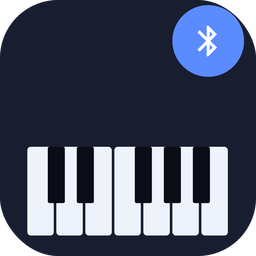
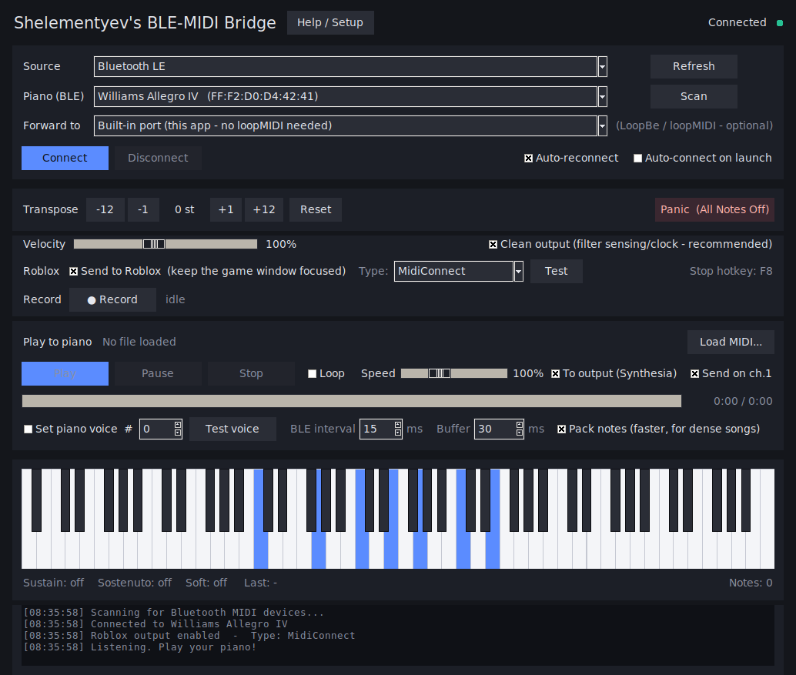

<p align="center">
  
</p>

<h1 align="center">Shelementyev's BLE-MIDI Bridge</h1>

<p align="center"><b>A reliable Bluetooth &amp; USB MIDI bridge for your digital piano — route it into Synthesia, DAWs, and MIDI files, and (uniquely) into Roblox piano games.</b></p>

Shelementyev's BLE-MIDI Bridge connects your digital piano to your PC and sends what you play wherever you need it: into Synthesia and DAWs, to and from MIDI files, with a live visualizer and recording. And because it speaks Bluetooth, it does something no other tool does — it lets a **Bluetooth piano play in Roblox** piano games like Piano Rooms and Visual Pianos.

**Works with any Bluetooth or USB MIDI keyboard — any size (25 to 88 keys), weighted or non-weighted, with or without pedals.**



---

## Features

- **Bluetooth LE pianos** — connect a BLE digital piano directly, no virtual cables or workarounds.
- **USB pianos** — a rock-solid wired option that handles even very fast pieces flawlessly.
- **Two ways into Roblox:**
  - **MidiConnect** — drives the *Piano Rooms* and *Visual Pianos* games with full velocity and sustain, using the MidiConnect protocol (see Credits).
  - **QWERTY output** — plays the many letter-key piano games (the "Virtual Piano" style): sharps on Shift, sustain on Space, with out-of-range notes folded in by octaves so every key plays.
- **MIDI file playback** — load a `.mid` and send it to your piano and/or straight into a game, with tempo, loop, and transpose.
- **Send to other software** — pass your piano through to Synthesia or a DAW with a built-in virtual MIDI port (macOS/Linux) or loopMIDI (Windows).
- **Live 88-key visualizer** and one-click **recording** to a `.mid` file.
- **F8 panic hotkey** — instantly release a stuck key or pedal without alt-tabbing out of the game.
- **Test button** — fires a C-major scale into the game so you can confirm your setup before you play.

## Requirements

- **Windows** for the Roblox feature (the keystroke output uses `pydirectinput`, which is Windows-only). The MIDI-port, file-playback, visualizer, and recording features also run on macOS/Linux.
- **Any** Bluetooth-MIDI or USB-MIDI keyboard — any size (25 to 88 keys), weighted or non-weighted, with or without pedals. It only needs standard MIDI over Bluetooth or USB, which is virtually every digital piano and keyboard.
- For Bluetooth, a PC with Bluetooth LE.

## Install

### Option A — download the app (easiest)

Grab the latest `Shelementyevs-BLE-MIDI-Bridge.exe` from the [Releases page](https://github.com/Shelementyevv/ble-midi-bridge/releases) and double-click it. It's a single file — no installer, nothing to set up.

### Option B — run from source

```bash
pip install -r requirements.txt
python ble_midi_bridge_gui.py
```

To build your own standalone `.exe`, run `build.bat` (it installs the build tools and produces `dist/Shelementyevs-BLE-MIDI-Bridge.exe`).

## Quick start

1. **Connect your piano.** Set *Source* to Bluetooth LE and Scan, or choose your USB port, then click **Connect**.
2. **Turn on Roblox output.** Tick **Send to Roblox** and choose a **Type**:
   - **MidiConnect** if you're playing *Piano Rooms* or *Visual Pianos* (open the game and click its in-game MidiConnect button first).
   - **QWERTY output** for any other piano game you'd normally play with letter keys.
3. **Open your game, keep its window focused, and play.** Press **Test** first if you want to confirm the keys are landing.

You do **not** need to pick a MIDI output for Roblox — that option is only for sending your piano to other PC software.

Full setup notes, including connecting over Bluetooth vs USB and using a virtual MIDI port, are in the in-app **Help / Setup** window.

## Choosing the Roblox type

| | MidiConnect | QWERTY output |
|---|---|---|
| **For** | *Piano Rooms* &amp; *Visual Pianos* | Letter-key piano games (Virtual Piano style) |
| **Velocity (dynamics)** | Yes | Usually no |
| **Sustain pedal** | Yes | Yes (held as the Space bar) |
| **Setup** | Click the in-game MidiConnect button | Just focus the game |

## Troubleshooting

- **Nothing happens in Roblox** — the game window must be focused, *Send to Roblox* must be on, and the Type must match the game. Press **Test**.
- **A "pydirectinput" message on first use** — run `pip install pydirectinput` (already included in the `.exe` build).
- **MidiConnect type does nothing** — make sure you clicked the MidiConnect button inside *Piano Rooms* or *Visual Pianos* so the game is listening.
- **QWERTY output plays wrong notes** — that game may use a different layout, or a non-US keyboard layout is interfering; set your system keyboard to US English while playing.
- **Fast songs bunch up over Bluetooth** — this is a hardware limit of the piano's Bluetooth, not the app. Use USB for those pieces.

## Credits

The **MidiConnect** option speaks to *Piano Rooms* and *Visual Pianos* using the **MidiConnect** protocol created by **LordHenryVonHenry**. Huge thanks for that work — it's what makes that connection possible, and this project builds directly on top of it.

→ [github.com/LordHenryVonHenry/RobloxMidiConnect](https://github.com/LordHenryVonHenry/RobloxMidiConnect)

## License

Shelementyev's BLE-MIDI Bridge is free software, licensed under the **GNU General Public License v3.0** (GPLv3). You're free to use, study, share, and modify it; if you distribute a modified version, it must also be released under the GPLv3. See the [`LICENSE`](LICENSE) file for the full text.

The **MidiConnect** protocol it speaks is the work of **LordHenryVonHenry** (see Credits). This project only links and credits that work and contains none of its source code, so the GPLv3 here covers this project's own code.

## Disclaimer

This project is not affiliated with, endorsed by, or sponsored by Roblox Corporation. Roblox is a trademark of Roblox Corporation. Use it in accordance with the terms of service of any game you connect to.
